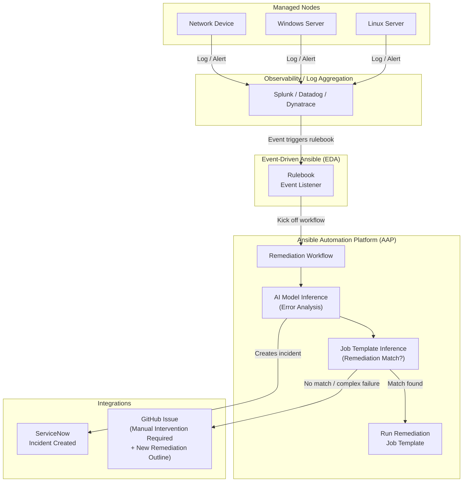

# Ansible AIOps Demo

[](https://devspaces.apps.ocp.shadowman.dev/#https://github.com/Megalith-Development/Ansible-Demo-AIOps)

An end-to-end AIOps demonstration using Ansible Automation Platform, Event-Driven Ansible, and AI model inference to detect, analyze, and remediate infrastructure issues automatically.

---

## AIOps Workflow



---

## Structure

```
.
├── aap_config/                     # AAP config-as-code (infra.aap_configuration)
│   ├── all/                        # Shared resources: org, credentials, projects
│   │   ├── auth.yml
│   │   ├── credential_types.yml
│   │   ├── credentials.yml
│   │   ├── organizations.yml
│   │   └── projects.yml
│   ├── controller/                 # Controller-specific: inventories, templates, workflows
│   │   ├── inventories.yml
│   │   ├── job_templates.yml
│   │   └── workflow_job_templates.yml
│   └── eda/                        # EDA projects and rulebook activations
│       ├── activations.yml
│       └── projects.yml
├── collections/
│   └── requirements.yml            # Collection dependencies
├── inventories/                    # Static inventory files
├── playbooks/
│   ├── configure_aap.yml           # Dispatch playbook — provisions all AAP resources
│   ├── ai_remediation.yml          # AI inference → AAP job template launch
│   ├── cpu_stress.yml              # Trigger high CPU utilization on managed nodes
│   ├── cpu_increase_allocation.yml # Proxmox VM CPU increase (≤10%)
│   ├── cpu_kill_top_process.yml    # Kill top CPU-consuming process
│   ├── snow_create_incident.yml    # Open a ServiceNow incident
│   ├── snow_update_incident.yml    # Update a ServiceNow incident
│   └── github_issue.yml            # Open a GitHub issue for manual remediation
├── roles/
│   ├── ai_inference/               # Call OpenAI-compatible API, return structured recommendation
│   ├── cpu_remediation/            # tasks_from: increase_cpu | kill_top_process
│   ├── github_issue/               # Open a GitHub issue via API
│   └── servicenow_incident/        # tasks_from: create | update
├── rulebooks/
│   ├── webhook_rulebook.yml        # Listen for webhook alerts (production)
│   └── range_rulebook.yml          # Simulated event source (demo/testing)
├── vault.yml                       # Encrypted credentials (ansible-vault)
└── .github/workflows/validate.yml  # CI: ansible-lint + spell check
```

---

## Roles

| Role | Entry Points | Purpose |
|---|---|---|
| `ai_inference` | `main` | Sends error context to an OpenAI-compatible API; returns `ai_inference_recommendation` fact with action, job template name, and ServiceNow content |
| `cpu_remediation` | `increase_cpu`, `kill_top_process` | Increases Proxmox VM CPU by up to 10%, or kills the top CPU-consuming process on a managed node |
| `servicenow_incident` | `create`, `update` | Creates or updates a ServiceNow incident via `servicenow.itsm` |
| `github_issue` | `main` | Opens a GitHub issue via the GitHub REST API |

---

## AAP Job Templates

| Template | Playbook | Purpose |
|---|---|---|
| CPU - Stress | `cpu_stress.yml` | Pin all vCPUs to >80% to trigger an alert |
| CPU - Increase Allocation | `cpu_increase_allocation.yml` | Increase Proxmox VM CPU (automated remediation) |
| CPU - Kill Top Process | `cpu_kill_top_process.yml` | Kill top CPU process (automated remediation) |
| AI Remediation | `ai_remediation.yml` | AI inference + launch matched job template |
| SNOW - Create Incident | `snow_create_incident.yml` | Open ServiceNow incident |
| SNOW - Update Incident | `snow_update_incident.yml` | Update/resolve ServiceNow incident |
| GitHub Issue | `github_issue.yml` | Escalate with a GitHub issue |

### Remediation Workflow

```
SNOW - Create Incident
  └─ success → AI Remediation
                ├─ success → SNOW - Update Incident (resolved)
                └─ failure → GitHub Issue
                               └─ success → SNOW - Update Incident (in_progress / escalated)
```

---

## Getting Started

### Prerequisites

- Python 3.11+
- Ansible Core 2.14+
- Access to AAP 2.5+

### Install dependencies

```bash
ansible-galaxy collection install -r collections/requirements.yml
```

### Configure credentials

Fill in [vault.yml](vault.yml) and encrypt it:

```bash
ansible-vault encrypt vault.yml
```

### Provision AAP

Loads all configuration from `aap_config/` and applies it via `infra.aap_configuration.dispatch`:

```bash
ansible-playbook playbooks/configure_aap.yml \
  -e @vault.yml \
  --vault-password-file .vault_pass
```

### Trigger a demo event

Stress CPU on a managed node to fire an alert through the full workflow:

```bash
ansible-playbook playbooks/cpu_stress.yml \
  -i inventories/inventory.yml \
  --limit <hostname>
```

---

## CI / Quality

- **ansible-lint** — enforces Ansible best practices on every push
- **cspell** — spell checks README
- **Syntax check** — validates all playbooks in `playbooks/`

---

## Contributing

- Open issues for ideas or bug reports
- Submit PRs against `main`
- See [.github/PULL_REQUEST_TEMPLATE.md](.github/PULL_REQUEST_TEMPLATE.md) for the contribution checklist
