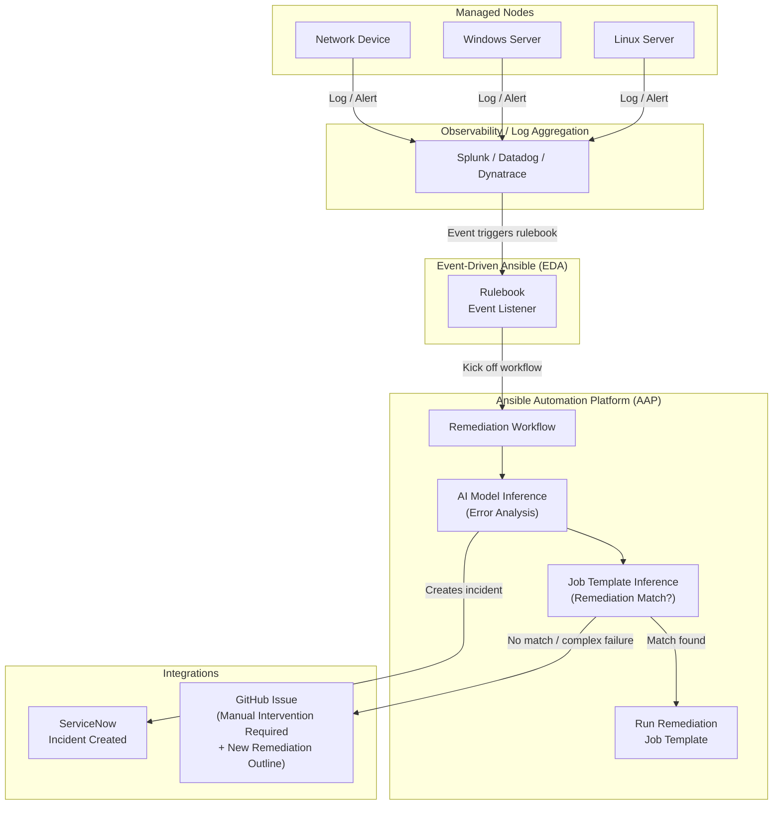

# Ansible AIOps Demo

[](https://devspaces.apps.ocp.shadowman.dev/#https://github.com/Megalith-Development/Ansible-Demo-AIOps)

An end-to-end AIOps demonstration using Ansible Automation Platform, Event-Driven Ansible, and AI model inference to detect, analyze, and remediate infrastructure issues automatically.

---

## AIOps Workflow



---

## Structure

```
.
├── aap_config/                     # AAP config-as-code (infra.aap_configuration)
│   ├── all/                        # Shared resources: org, credentials, projects
│   │   ├── auth.yml
│   │   ├── credential_types.yml
│   │   ├── credentials.yml
│   │   ├── organizations.yml
│   │   └── projects.yml
│   ├── controller/                 # Controller-specific: inventories, templates, workflows
│   │   ├── inventories.yml
│   │   ├── job_templates.yml
│   │   ├── labels.yml
│   │   └── workflow_job_templates.yml
│   └── eda/                        # EDA projects and rulebook activations
│       ├── activations.yml
│       ├── credentials.yml
│       ├── decision_environments.yml
│       ├── event_streams.yml
│       └── projects.yml
├── collections/
│   └── requirements.yml            # Collection dependencies
├── inventories/                    # Static inventory files
├── playbooks/
│   ├── configure_aap.yml           # Dispatch playbook — provisions all AAP resources
│   ├── ai_remediation.yml          # AI inference → AAP job template launch
│   ├── cpu_check.yml               # Collect CPU usage snapshot for AI inference
│   ├── cpu_stress.yml              # Trigger high CPU utilization on managed nodes
│   ├── cpu_increase_allocation.yml # Proxmox VM CPU increase (≤10%)
│   ├── cpu_kill_top_process.yml    # Kill top CPU-consuming process
│   ├── memory_stress.yml           # Trigger high memory utilization for escalation testing
│   ├── snow_create_incident.yml    # Open a ServiceNow incident
│   ├── snow_update_incident.yml    # Update a ServiceNow incident
│   └── github_issue.yml            # Open a GitHub issue for manual remediation
├── roles/
│   ├── ai_inference/               # Call OpenAI-compatible API, return structured recommendation
│   ├── cpu_remediation/            # tasks_from: increase_cpu | kill_top_process
│   ├── github_issue/               # Open a GitHub issue via API
│   └── servicenow_incident/        # tasks_from: create | update
├── rulebooks/
│   └── dynatrace.yml               # Webhook listener for Dynatrace infrastructure alerts
├── vault.yml                       # Encrypted credentials (ansible-vault)
└── .github/workflows/validate.yml  # CI: ansible-lint + spell check
```

---

## Roles

| Role | Entry Points | Purpose |
|---|---|---|
| `ai_inference` | `main` | Sends error context to an OpenAI-compatible API; returns `ai_inference_recommendation` fact with action, job template name, and ServiceNow content |
| `cpu_remediation` | `check_cpu`, `increase_cpu`, `kill_top_process` | Collects CPU usage snapshot, increases Proxmox VM CPU by up to 10%, or kills the top CPU-consuming process on a managed node |
| `servicenow_incident` | `create`, `update` | Creates or updates a ServiceNow incident via `servicenow.itsm` |
| `github_issue` | `main` | Opens a GitHub issue via the GitHub REST API |

---

## AAP Job Templates

| Template | Playbook | Purpose |
|---|---|---|
| AI Ops - CPU Stress | `cpu_stress.yml` | Pin all vCPUs to >80% to trigger an alert |
| AI Ops - Memory Stress | `memory_stress.yml` | Allocate memory to trigger infrastructure alerts (escalation testing) |
| AI Ops - CPU Check | `cpu_check.yml` | Collect CPU usage snapshot for AI inference |
| AI Ops - CPU Increase Allocation | `cpu_increase_allocation.yml` | Increase Proxmox VM CPU (automated remediation) |
| AI Ops - CPU Kill Top Process | `cpu_kill_top_process.yml` | Kill top CPU process (automated remediation) |
| AI Ops - AI Remediation | `ai_remediation.yml` | AI inference + launch matched job template |
| AI Ops - SNOW Create Incident | `snow_create_incident.yml` | Open ServiceNow incident |
| AI Ops - SNOW Update Incident | `snow_update_incident.yml` | Update/resolve ServiceNow incident |
| AI Ops - GitHub Issue | `github_issue.yml` | Escalate with a GitHub issue |

### Remediation Workflow

```
SNOW - Create Incident
  └─ success → AI Remediation
                ├─ success → SNOW - Update Incident (resolved)
                └─ failure → GitHub Issue
                               └─ success → SNOW - Update Incident (in_progress / escalated)
```

---

## Getting Started

### Prerequisites

- Python 3.11+
- Ansible Core 2.14+
- Access to AAP 2.5+

### Install dependencies

```bash
ansible-galaxy collection install -r collections/requirements.yml
```

### Configure credentials

Fill in [vault.yml](vault.yml) with your environment-specific values and encrypt it:

<details>
<summary>Example vault.yml template</summary>

```yaml
---
# Ansible Vault — encrypt this file before committing:
#   ansible-vault encrypt vault.yml
#
# To edit in place after encryption:
#   ansible-vault edit vault.yml
#
# To run the configure_aap playbook with vault:
#   ansible-playbook playbooks/configure_aap.yml -e @vault.yml --ask-vault-pass
#   ansible-playbook playbooks/configure_aap.yml -e @vault.yml --vault-password-file .vault_pass

# --- AAP Configuration ---
vault_aap_hostname: "aap-controller.example.com"         # e.g. aap.example.com
vault_aap_token: "REDACTED_AAP_TOKEN"            # AAP personal access token or service account token

# --- Phoenix AAP (EDA Controller Credential) ---
# vault_phoenix_aap_host: "https://aap-controller.example.com/api/controller/"
vault_phoenix_aap_host: "https://aap-controller.example.com/api/controller/"  # AAP Controller API URL
vault_phoenix_aap_username: "admin"
# vault_phoenix_aap_password: "REDACTED_PASSWORD"
vault_phoenix_aap_password: "REDACTED_PASSWORD"  # AAP admin password

# --- AI API ---
vault_ai_api_url: "https://api.openai.com/v1/chat/completions"            # e.g. https://api.openai.com/v1/chat/completions
vault_ai_model: "gpt-4o"              # e.g. gpt-4o
vault_ai_api_key: "REDACTED_API_KEY"            # API key

# --- Proxmox ---
vault_proxmox_api_host: "https://proxmox.example.com:8006"      # e.g. proxmox.example.com
vault_proxmox_api_user: "ansible@pve"      # e.g. ansible@pve
vault_proxmox_api_token_id: "automation"  # e.g. automation
vault_proxmox_token_secret: "REDACTED_UUID"  # Proxmox API token UUID
vault_proxmox_node: "pve"      # Proxmox node name where the VMs are located, e.g. pve

# --- ServiceNow ---
vault_snow_instance_url: "https://instance.service-now.com/"     # e.g. https://instance.service-now.com
vault_snow_username: "api-user"         # ServiceNow automation account username
vault_snow_password: "REDACTED_PASSWORD"         # ServiceNow automation account password

# --- GitHub ---
vault_github_token: "REDACTED_GITHUB_TOKEN"          # GitHub personal access token (scope: repo)
vault_github_repo: "owner/repository"           # owner/repo format for GitHub API
vault_github_repo_url: "https://github.com/owner/repository.git"  # Full URL for SCM operations
vault_github_username: "github_username"       # GitHub username for SCM credential

# --- Machine ---
vault_machine_username: "ansible"      # e.g. ansible
vault_machine_password: "REDACTED_PASSWORD"      # Password for the managed Linux node user

# --- Dynatrace ---
vault_dynatrace_token: "REDACTED_TOKEN"      # Dynatrace API token for event stream authentication

# --- Red Hat Container Registry ---
vault_rh_container_registry_username: "org_id|service_account"  # Red Hat Container Registry username (often an organization ID)
vault_rh_container_registry_token: "REDACTED_JWT_TOKEN"  # Red Hat Container Registry token (often prefixed with 'rhcc-')
vault_rh_container_registry_host: "registry.redhat.io"  # Red Hat Container Registry host
```

</details>

Encrypt the vault file before committing:

```bash
ansible-vault encrypt vault.yml
```

### Provision AAP

Loads all configuration from `aap_config/` and applies it via `infra.aap_configuration.dispatch`:

```bash
ansible-playbook playbooks/configure_aap.yml \
  -e @vault.yml \
  --vault-password-file .vault_pass
```

### Trigger a demo event

Stress CPU on a managed node to fire an alert through the full workflow:

```bash
ansible-playbook playbooks/cpu_stress.yml \
  -i inventories/inventory.yml \
  --limit <hostname>
```

---

## CI / Quality

- **ansible-lint** — enforces Ansible best practices on every push
- **cspell** — spell checks README
- **Syntax check** — validates all playbooks in `playbooks/`

---

## Contributing

- Open issues for ideas or bug reports
- Submit PRs against `main`
- See [.github/PULL_REQUEST_TEMPLATE.md](.github/PULL_REQUEST_TEMPLATE.md) for the contribution checklist
